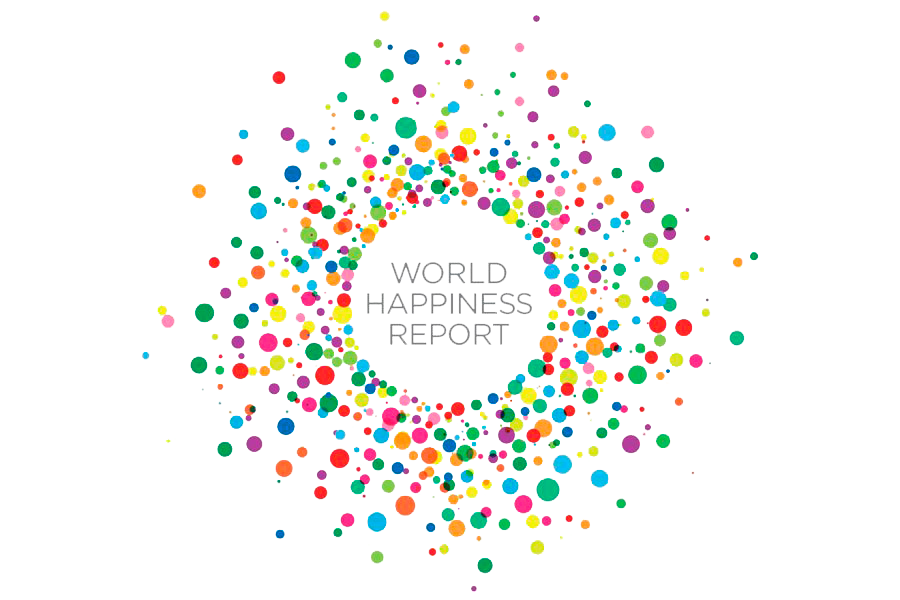

# 📊 Data Insights: Visualización del '_World Happiness Report 2021/2024_'

## 📖 Descripción del Proyecto

Este proyecto tiene como objetivo transformar datos crudos en información útil y visualmente atractiva. Trabajaremos con el dataset '_World Happiness Report 2021/2024_' para analizar los factores que influyen en la felicidad mundial y presentar los hallazgos mediante dashboards en Tableau.




## 🎯 Objetivos

✔ Explorar y limpiar el dataset obtenido para su análisis.

✔ Crear visualizaciones interactivas en Tableau.

✔ Presentar insights clave mediante storytelling con datos.

✔ Implementar Scrum para el desarrollo del proyecto en equipo.


## 🛠 Tecnologías y Herramientas

- **Python**: Lenguaje de programación utilizado para desarrollar la lógica.  
    - **Librerías de Python**: *pandas*, *numpy*, *matplotlib*, *seaborn*.  
- **Tableau**: Herramienta utilizada para crear dashboards interactivos y visualmente impactantes, permitiendo explorar y comunicar insights clave del *World Happiness Report 2021/2024* de manera efectiva.  
- **Jupyter Notebook**: Para análisis exploratorio y visualización.  
- **GitHub**: Para el control de versiones y la colaboración en equipo.  
- **Kaggle**: Plataforma utilizada para obtener el dataset *World Happiness Report 2021/2024* y explorar notebooks de referencia. 
    - [Dataset en Kaggle 2021](https://www.kaggle.com/datasets/ajaypalsinghlo/world-happiness-report-2021).
    - [Dataset en Kaggle 2024](https://www.kaggle.com/datasets/jainaru/world-happiness-report-2024-yearly-updated).
- **CSV**: Manejo de datos de empleados.  
- **Scrum**: Nuestra metodología ágil para mantener el proyecto en marcha.  


## 🔍 Fases del Proyecto

1. **Buscar tema y dataset** 🧐
    - Exploración de datasets en Kaggle y otras fuentes analizando el número de datos adecuados para poder trabajar.
    - Selección del dataset '_World Happiness Report 2021/2024_'.
    
2. **Análisis Exploratorio de Datos (EDA)** 🧐 
   - Identificación de valores nulos, duplicados y datos atípicos.
   - Correlaciones clave.  

3. **Transformación de Datos** 🔄
   - Limpieza y normalización de datos. 
   - Corrección de errores. 

4. **Visualización de Datos** 📊 
   - Gráficos de barras, histogramas y boxplots para identificar tendencias.  
   - Comparaciones de felicidad entre países.  


## 🏗️ Estructura del Repositorio

```
📁 project-da-promo-47-modulo-4-team-3  
│── 📂 files/     
│───── 📂 dataset_1_happiness/  
│──────── 📜 2015.csv
│──────── 📜 2016.csv
│──────── 📜 2017.csv
│──────── 📜 2018.csv
│──────── 📜 2019.csv
│───── 📂 dataset_2_happiness/ 
│──────── 📜 word-happiness-report-2021.csv
│───── 📂 dataset_3_happiness/
│──────── 📜 World-happiness-report-2024.csv
│──────── 📜 World-happiness-report-2024.csv
│──────── 📜 world-happiness-report.csv
│───── 📜 correlaciones.csv
│───── 📜 word_happiness_report_2021_2024.csv
│── 📂 images/ 
│───── 📷 WHR_Caras.png
│───── 📷 WHR_Logo_Horizontal.png
│───── 📷 WHR_Logo_Puntitos.png
│───── 📷 WHR_Logo_Fondo.png
│── 📜 Proyecto Happiness Paola, Lucia, Katie.twbx
│── 📜 README.md
│── 📜 world_happiness.ipynb   
```


## 📌 Cómo Usar Este Proyecto

1️⃣ **Clona el repositorio:**
    
    - `git clone https://github.com/lucia18nozal/project-da-promo-47-modulo-4-team-3`
    

2️⃣ **Instala las dependencias necesarias:**
    
Con "!" al principio si es desde código y sin ella si es desde terminal.

    - `pip install seaborn`
    - `pip install matplotlib`
    

3️⃣ **Ejecuta el análisis de datos:**
    
⚠ **Importante**: Para evitar errores de autenticación, es necesario ejecutar el código a partir de la celda 11. Previamente está indicado con un "EJECUTAR DESDE AQUÍ".

La autenticación se ha configurado en un entorno local específico, por lo que las celdas anteriores contienen configuraciones dependientes de dicho entorno. Si intentas ejecutar el código desde el principio en otro equipo, podría fallar debido a la falta de esta configuración previa.

Si necesitas realizar la autenticación en tu propio entorno, contacta con el equipo.


4️⃣ **Explora los dashboards en Tableau.**

    - `https://public.tableau.com/views/ProyectoHappinessPaolaLuciaKatie28_02/Rankings?:language=es-ES&publish=yes&:sid=&:redirect=auth&:display_count=n&:origin=viz_share_link`


## 📊 Visualización de Datos

Los resultados del análisis se presentarán en un dashboard interactivo en Tableau, mostrando tendencias y factores clave del índice de felicidad global.


## 👩‍💻 Integrantes del equipo
- Katherine Gortz Rogers.
- Paola Nadales Sánchez de Puerta.
- Lucía Nozal Benito.